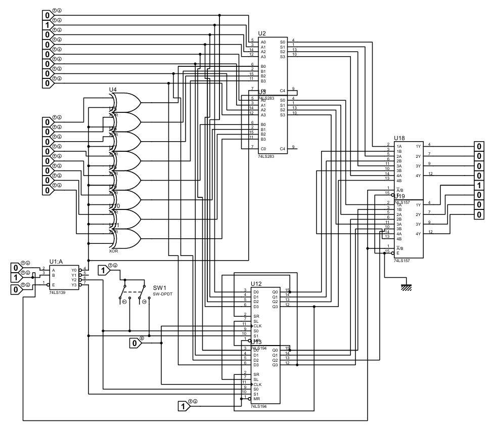
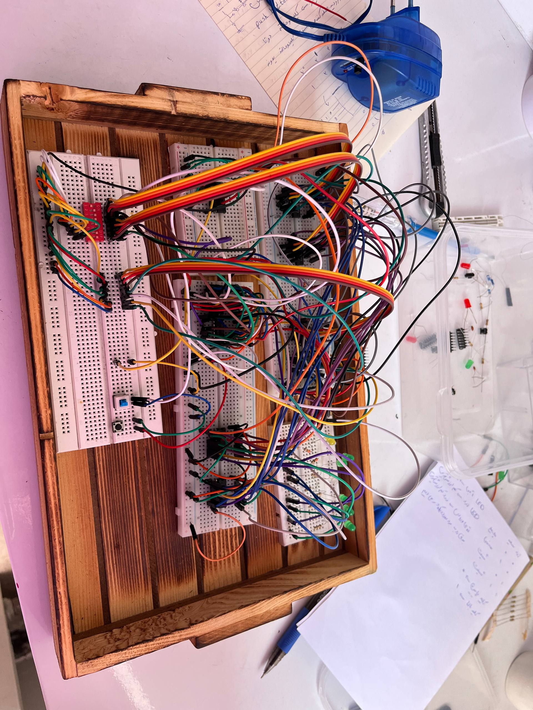
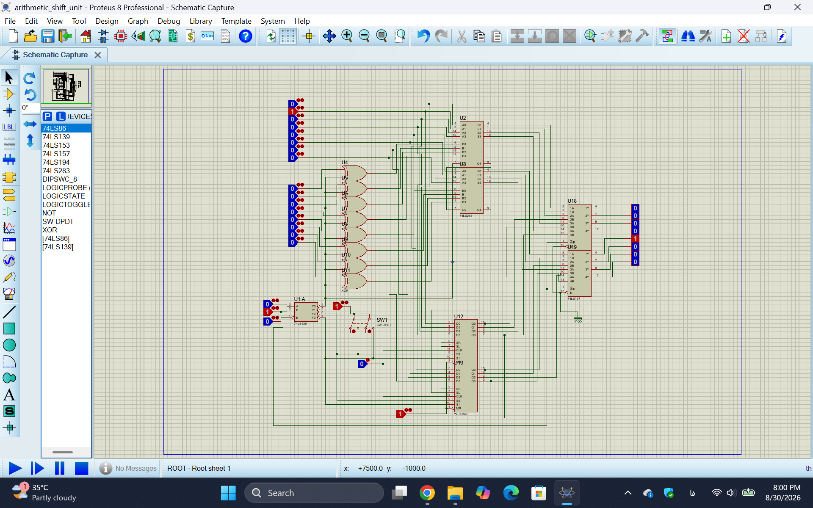

# 8-Bit Arithmetic and Shift Unit

## Digital Systems Course Project

An 8-bit Arithmetic and Shift Unit designed and implemented using TTL logic integrated circuits.

This project presents the design, simulation, and hardware implementation of a multifunctional digital system capable of performing arithmetic and shifting operations on 8-bit binary data.

The system supports four different operating modes:

- 8-bit Addition
- 8-bit Subtraction
- Logical Right Shift
- Logical Left Shift

The operation selection is controlled by a 2-bit decoder, and the final output is selected using multiplexers.

---

# Project Overview

The main goal of this project is to design a digital processing unit that can perform multiple operations using basic digital logic components.

The designed system consists of four main sections:

1. Operation Selection Unit
2. Arithmetic Processing Unit
3. Shift Register Unit
4. Output Selection Unit

The complete circuit was first designed and tested in Proteus simulation software and then implemented practically using TTL ICs on a breadboard.

---

# System Block Diagram

The general architecture of the system is shown below:

```

```
            +----------------+
```

Input Data ---->| Arithmetic Unit |
+----------------+
|
|
+----------------+
Input Data ---->| Shift Register |
+----------------+
|
|
+-------------+
Control Signals ->| Multiplexer |
+-------------+
|
Output

```

---

# Operation Selection

The operation mode is selected using a 2-bit decoder (74LS139).

The decoder receives two control inputs and activates the required section.

| Control Input | Operation |
|--------------|-----------|
| 00 | Addition |
| 01 | Subtraction |
| 10 | Right Shift |
| 11 | Left Shift |

---

# Circuit Overview

Complete circuit schematic designed in Proteus:



---

# Hardware Implementation

The circuit was physically implemented using breadboards, TTL integrated circuits, switches, LEDs, and clock input.



---

# Components Used

The main components used in this project are:

| Component | Description |
|-----------|-------------|
| 74LS139 | 2-to-4 Decoder |
| 74LS283 | 4-bit Binary Full Adder |
| 74LS194 | Universal Shift Register |
| 74LS86 | XOR Gate |
| 74LS157 | 2-to-1 Multiplexer |
| LED | Output Display |
| Push Button | Clock Signal |
| DPDT Switch | Operation Control |

---

# 1. Decoder Unit

## 74LS139 Decoder

The decoder is responsible for selecting the required operation.

According to the input control bits, one of the four operation modes becomes active.

The decoder outputs control:

- Arithmetic mode selection
- Shift mode selection
- Output multiplexer selection

---

# 2. Arithmetic Unit

The arithmetic section is designed using two 4-bit binary adders (74LS283) connected together to create an 8-bit arithmetic circuit.

The two adders are connected in cascade:

- Carry output of the first adder is connected to carry input of the second adder.
- Together they create an 8-bit addition/subtraction unit.

---

## Addition Operation

For addition mode:

- XOR gates pass the second operand without modification.
- Carry input is set to zero.

The performed operation is:

```

A + B

```

---

## Subtraction Operation

Subtraction is implemented using the two's complement method.

The circuit performs:

```

A - B = A + (~B) + 1

```

During subtraction:

- XOR gates invert the second input.
- Initial carry input becomes 1.
- The adder performs two's complement subtraction.

---

# Arithmetic Circuit

The arithmetic section uses XOR gates to control the second operand:

```

Normal Mode:

B XOR 0 = B

Subtraction Mode:

B XOR 1 = NOT(B)

```

The carry input determines whether the circuit performs addition or subtraction.

---

# 3. Shift Register Unit

The shifting operation is implemented using two 74LS194 universal shift registers.

The 74LS194 supports:

- Parallel loading
- Left shifting
- Right shifting
- Clock controlled operation

The shift direction is selected using the decoder outputs.

---

## Shift Operation

### Right Shift

The bits are shifted toward the least significant bit:

```

ABCDEFGH

0ABCDEFG

```

---

### Left Shift

The bits are shifted toward the most significant bit:

```

ABCDEFGH

BCDEFGH0

```

---

# Shift Register Circuit

The shift registers receive clock pulses from the push button.

The control inputs S0 and S1 determine the operating mode.

---

# 4. Output Multiplexer

Each operation generates an 8-bit output.

To select the desired output, multiplexers are used.

The output section uses 74LS157 multiplexers.

Functions:

- Select arithmetic output
- Select shift output
- Send final 8-bit result to LEDs

---

# Proteus Simulation

The complete system was simulated using Proteus.

The simulation verifies:

- Correct operation selection
- Arithmetic calculations
- Shift operations
- Output display



---

# Practical Testing

After successful simulation, the circuit was implemented practically.

The hardware implementation includes:

- TTL ICs
- Breadboards
- Jumper wires
- LEDs
- Switches

The physical circuit successfully demonstrates the functionality of the designed Arithmetic and Shift Unit.

---

# Demo Video

A demonstration video of the working project is available:

```

demo/8-bit-arithmetic-shift-unit-demo.mp4

```

---

# Project Files Structure

```

8-Bit-Arithmetic-Shift-Unit

│
├── README.md
│
├── demo
│   ├── 8-bit-arithmetic-shift-unit-demo.mp4
│   └── README.md
│
├── documentation
│   ├── project-report-fa.pdf
│   └── README.md
│
├── images
│   ├── circuit-overview.png
│   ├── hardware-implementation.jpg
│   ├── proteus.png
│   └── README.md
│
├── simulation
│   ├── arithmetic_shift_unit.pdsprj
│   └── README.md
│

```

---

# How to Run

## Proteus Simulation

1. Install Proteus Design Suite.
2. Open:

```

simulation/arithmetic_shift_unit.pdsprj

```

3. Run the simulation.
4. Change operation control switches.
5. Observe the LED output.

---

# Results

The implemented system successfully performs:

| Function | Status |
|----------|--------|
| Addition | Successfully Tested |
| Subtraction | Successfully Tested |
| Right Shift | Successfully Tested |
| Left Shift | Successfully Tested |

Both simulation and hardware implementation confirmed the correct operation of the designed circuit.

---

# Conclusion

This project demonstrates the design and implementation of an 8-bit Arithmetic and Shift Unit using basic TTL digital logic components.

By combining:

- Decoder circuits
- Binary adders
- XOR logic
- Shift registers
- Multiplexers

a complete multifunctional digital processing unit was successfully developed.

The project provides practical experience in digital system design, simulation, and hardware implementation.

---

# Author

**Arghavan Memari**

Digital Systems Course Project
```
